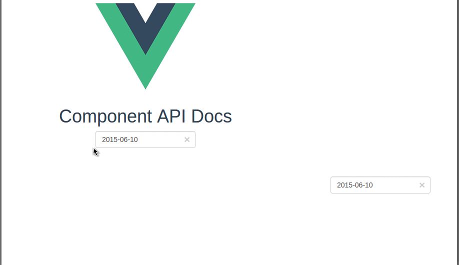

# vue2-calendar

> vue2 calendar

## Build Setup

``` bash
# install dependencies
npm install

# serve with hot reload at localhost:8080
npm run dev

# build for production with minification
npm run build

# run unit tests
npm run unit

# run all tests
npm test
```

##Screenshot





## Usage

Component path:

src/components/Calendar.vue


```html
<calendar
  :value="value"
  :disabled-days-of-week="disabled"
  :format="format"
  :clear-button="clear"
  :placeholder="placeholder"
  :pane="2"
  :has-input="false"
  :on-day-click="onDayClick2"
  :special-days="_dateMap"
  :sync-content="syncContent"
></calendar>

```


###Props

|          Name         |    Type    |    Default     |                                                         Description                                                         |
| --------------------- | ---------- | -------------- | --------------------------------------------------------------------------------------------------------------------------- |
| value                 | `String`   | ''             | Value of the input DOM                                                                                                      |
| width                 | `String`   | '200px'        | Width of the input DOM                                                                                                      |
| format                | `String`   | `MMMM/dd/yyyy` | The date format, combination of d, dd, M, MM, MMM, MMMM, yyyy.                                                              |
| disabled-days-of-week | `Array`    |                | Days of the week that should be disabled. Values are 0 (Sunday) to 6 (Saturday). Multiple values should be comma-separated. |
| clear-button          | `Bollean`  | false          | If true shows an × shaped button to clear the selected date. Usefull in forms where date entry is optional.                 |
| placeholder           | `String`   |                | Placeholder to put on the input field when no date (null or empty) is set                                                   |
| hasInput              | `Boolean`  | true           | Default is has-input style, if don't have input will show pane directly                                                     |
| pane                  | `Number`   | 1              | pane count                                                                                                                  |
| borderWidth           | `Number`   | 2              | This value is for calculating the pane width                                                                                |
| onDayClick            | `Function` |                | Only for `hasInput` set false                                                                                               |
| syncContent           | `Function` |                | sync content                                                                                                                |
| specialDays           | `Object`   |                | To repalce the day text                                                                                                     |


```javascript
  props: {
    value: {
      type: String
    },
    format: {
      default: 'MM/dd/yyyy'
    },
    disabledDaysOfWeek: {
      type: Array,
      default () {
        return []
      }
    },
    width: {
      type: String,
      default: '200px'
    },
    clearButton: {
      type: Boolean,
      default: false
    },
    lang: {
      type: String,
      default: navigator.language
    },
    placeholder: {
      type: String
    },
    hasInput: {
      type: Boolean,
      default: true
    },
    pane: {
      type: Number,
      default: 1
    },
    borderWidth: {
      type: Number,
      default: 2
    },
    onDayClick: {
      type: Function,
      default: function () {}
    },
    syncContent: {
      type: Function,
      default: function () {}
    },
    specialDays: {
      type: Object,
      default: function () {
        return {}
      }
    }
  }
```


##Credits


Inspired by [vue-strap](https://github.com/yuche/vue-strap) datepicker component.


For detailed explanation on how things work, checkout the [guide](http://vuejs-templates.github.io/webpack/) and [docs for vue-loader](http://vuejs.github.io/vue-loader).
